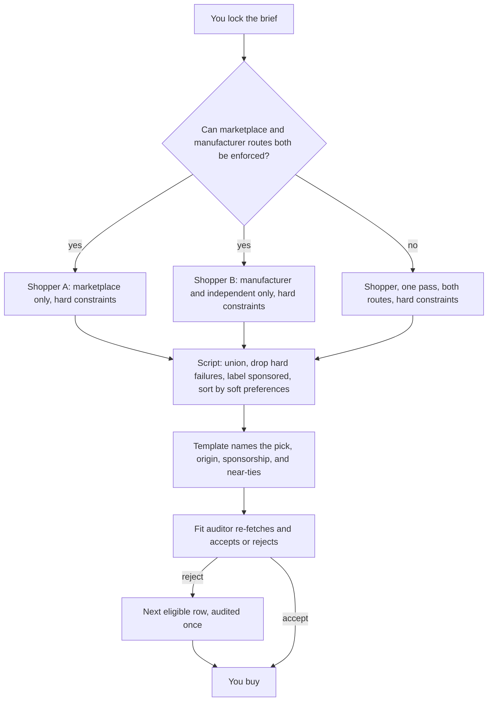

# Shopping team

Open this folder as its own Cursor project (File → Open Folder) so the role files under `.cursor/agents/` load for this team only.

Frozen design: `ARCHITECTURE.md`. Front door: `AGENTS.md`.

## The brief

A brief is the one shopping spec for a run. Locking it means you confirm that spec before Shopper searches. The confirmed copy is stored as `brief.lock`. Changing it later is a separate checkpoint.

It holds:

- **Hard constraints** — must-haves the product has to meet
- **Exclusions** — what to leave out
- **Budget, region, and quantity** — or an explicit unspecified
- **Soft preferences** — nice-to-haves, ordered or weighted

Hard constraints and soft preferences stay separate. Shopper receives only the hard-constraint packet, so a preference cannot become the search query. Soft preferences stay on the locked brief and are used later, when the script sorts the shortlist. The Fit auditor receives the full brief plus the one row under review.

## Flow

## Human checkpoints

- Locking or changing the brief.
- Any hard constraint that is still ambiguous.
- Regulated or safety-critical goods, before a confident recommendation.
- Spend, accounts, and checkout.
- A second reject, a single-source label, or a near-tie you want to override.
